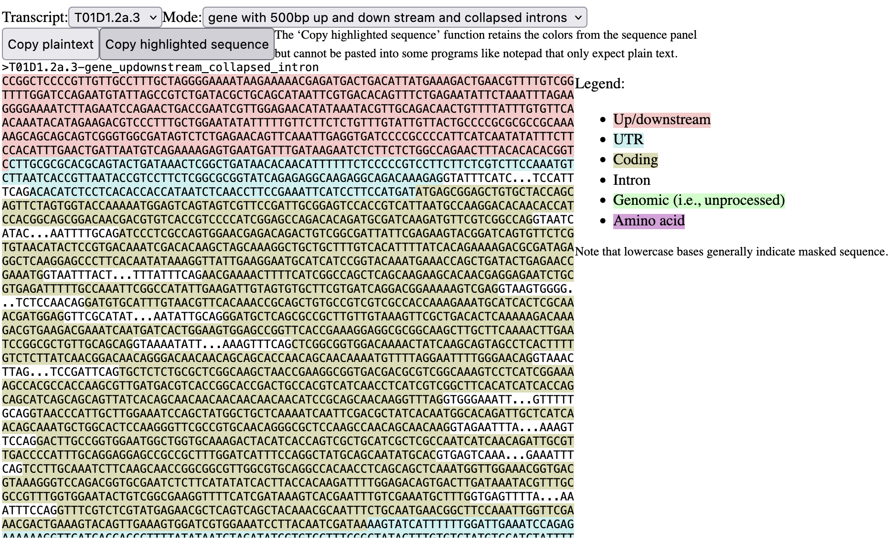

## Install

     $ npm install --save @gmod/genericseqpanel

## Usage

This React component creates a div containing highlighted FASTA DNA sequence. It uses as its input materials an NCList (i.e., a JBrowse 1 GFF3 formated dataset) anda bgzip, faidx indexed FASTA file.  It addition to those data sources, the component must also be supplied these items about the location:

* the name of the reference sequence (eg, "Chr1")
* the start and end coordinates (technically in interbase coordinates, but since the lookup is going to be an overlaps-type query, the details don't really matter if base versus interbase coordinates are used)
* the name of the gene and transcript for which the highlighted fasta is required
* the "mode" of highlighting required (more on that below)

### More usage details

    <GenericSeqPanel
      refseq="X"
      start={13201770}
      end={13216729}
      gene="WBGene00006749"
      transcript="R12H7.1a.2"
      mode="protein"
      nclistbaseurl="https://s3.amazonaws.com/agrjbrowse/MOD-jbrowses/WormBase/WS287/c_elegans_PRJNA13758/"
      urltemplate="tracks/Curated_Genes/{refseq}/trackData.jsonz"
      fastaurl="https://s3.amazonaws.com/wormbase-modencode/fasta/current/c_elegans.PRJNA13758.WS284.genomic.fa.gz"
    />

Several items here a self explanatory: refseq, start, and end are location infomation. The props gene and transcript are the names of the features in the NClist data set.  The remaining items are described here:

* mode - this is one of several keys that dictate what the output looks like. The options are:
   * genomic - The stretch of sequence from start to end with no special highlighting
   * genomic_sequence_updown - The strech of sequence from start to end with 500 base pairs of padding on both ends
   * cds - The coding sequence of the mRNA that is the result of in silico splicing
   * cdna - The CDS with UTRs added
   * protein - The amino acid sequence that results from the cds in silico transcription
   * gene - The genomic sequence from start to end with portions that are UTR and coding highlighted
   * gene_collapsed_intron - same as gene, but the introns are compressed to 10 base pairs at the splice junction and the remainer replaced with elipses
   * gene_updownstream - same as gene but with 500 bp of up and down stream sequence added 
   * gene_updownstream_collapsed_intron - same as gene_collapsed_intron but with up and downstream padding added
* nclistbaseurl - the base url for the NClist adapter (basically, it's the part before "tracks" in the url)
* urltemplate - the rest of the url that the NClis adapter uses. Typically, this will have `{refseq}` in it that will be interpolated with the refseq info
* fastaurl - the url to the fasta file. The location of the .fai and .gzi files will be assumed from this url

### Implementation details

This component makes use of three components developed by the JBrowse team:

* NCList from "@gmod/nclist" - This is what accesses the JBrowse 1 (NCList) data stores. It does an "overlaps" query of the NCList data set and returns all genes and their children (transcripts, exons, etc) that overlap. The code GenericSeqPanel then filters the feature set to the gene and transcript specified in the props of the component.
* BgzipIndexedFasta from "@gmod/indexedfasta" - This access the bgzipped, samtools faidx indexed fasta file. The locations of the .fai and .gzi files are found by just appending those extensions to the supplied fastaurl. 
* SequencePanel from "@jbrowse/core/BaseFeatureWidget/SequencePanel" - This component takes the feature data from NCList and the sequence data from BgzipIndexedFasta and generates the highlighted sequence that is controlled by the `mode` prop described above.

#### Places for potential future additions

This component does what I need it to do. Potential improviments include:
* Both NCList and BgzipIndexedFasta could be replaced with options to use other data accessing tools, like one for tabix-indexed GFF3 for feature data and twobit for reading .2bit sequence files.
* This component assumes all data are remote and accessed via URL. Options for local access could be added.
* It also assumes the "standard" genetic code. An option could be added to support others. 

Pull requests are accepted.

### Output

In this screenshot, the actual output of this component is the fasta sequence only. The other elements (dropdown menues and the legend) were added in the page to make it more clear how it can be used.

## Acknowledgements

I would very much like to thank [Colin Diesh](https://github.com/cmdcolin), who wrote large chunks of the code in this repo while teaching me the ins and outs of the pieces of JBrowse code I wanted to use.

## Academic Use

This package was written with funding from the [NHGRI](http://genome.gov) as part of the [JBrowse](http://jbrowse.org) project. If you use it in an academic project that you publish, please cite the most recent JBrowse paper, which will be linked from [jbrowse.org](http://jbrowse.org).

## License

MIT © [Scott Cain](https://github.com/scottcain)

